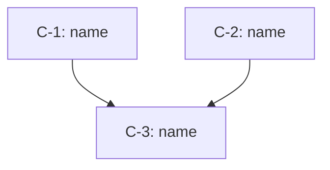

<!--
Output format for the ultra tier. The process that fills this in is
common/ultra.md.

Written to the project's drafts directory (`docs/drafts/` unless the project
uses another) as `<name>-spec.md`. This markdown file is the deliverable: it
is what the PR reviews, what the ultra ticket records the path of, and what a
chain parses to derive its waves. It is authoritative.

The document the user reads and reviews is an Artifact published from this
file — see ultra.md. The Artifact is a view, always regenerated from this
markdown and never edited on its own.

One document, four parts, in the order they get produced: the dispatch graph,
the strategy as prose, the system map as a diagram, then one section per
component carrying its contract. The map is what the user thinks with; the
contracts fall out of it.

A component is a named unit of work one ticket delivers, built and merged on
its own by one manager. Its section must let a reader answer four things:
what it owns, what it does when it is live, which components must be merged
before it can be built, and how it is proven. A component does not have to be
user-facing: shared infrastructure other components ride on is a component in
its own right — the means of a strategy, not a strategy.

**Components are one flat level.** Group them in the narrative however the
design reads — a heading and a paragraph saying what the group is for — but a
grouping is never a component: no entry in the dispatch graph, no `Needs`
line, and its heading is never `## C-N:`. A group that declares edges is a
second node over work already in the graph, and the chain dispatches the group
and its members both. Every id is `C-` and one plain number: no prefix for
foundation work, no decimal for a member of a group. Buildable and mergeable
alone means a component with its own number wherever it sits in the narrative;
anything else is not a component.

**Waves are derived, never written.** Nothing here groups components into
phases. The dispatch graph declares each component's edges, and the chain
topologically sorts them to decide what builds together. A cycle in those
edges is the one error that breaks the build: it has no valid order, so
nothing can start. Every edge is throughput given away — declare one only
where the design truly forces it.

**A component that lands everywhere declares it.** `exclusive: true` in the
dispatch graph makes it a wave of one: everything else waits, and nothing
builds beside it. It is for work that is physically everywhere rather than
behaviorally downstream — a move, a rename, a whole-tree reshaping. `needs`
cannot express that, because an edge says what a component consumes and this
one consumes nothing; it simply lands underneath any sibling still building.
Declare it only where a sibling would have its files moved out from under it,
since it costs the whole wave.

The dispatch graph and the `## C-N:` headings are the machine surface, and
they are load-bearing rather than styling:

  - The **first `yaml` fence in the document** is the dispatch graph. The
    chain reads it to derive waves; nothing outside it is a node, so the
    context, the map, and any grouping heading are prose the sort does not
    see.
  - dev-workflow reads a ticket's component at Step 2 by finding the
    `## C-N:` heading, and that section is the contract for the run.

Keep both exactly as shaped here, along with the `Owns:` and `Needs:` lines
and the Tests block. Everything else is open.

An id is permanent once assigned: a component added later takes the next free
number wherever it sits, and nothing already written is renumbered around it
— a ticket names its component by id, and renumbering would silently repoint
it.

The diagram is a mermaid fence. Lay the nodes out by dependency depth:
everything with no edges on the top row, and each component one row below the
deepest thing it needs. That is the same layering the chain derives waves
from, so the picture and the build order cannot disagree.
-->

# <SPEC NAME>

```yaml
components:
  - id: C-1
    name: <name>
    needs: []
  - id: C-2
    name: <name>
    needs: []
  - id: C-3
    name: <name>
    needs: [C-1, C-2]
```

<!--
The dispatch graph. One entry per component, in spec order. `needs` lists the
components this one consumes, and must match the section's `Needs` line.
`exclusive: true` is the whole-tree marker described above; omit it everywhere
it does not apply.

A spec whose every `needs` is empty is un-waveable from its own text. Either
give the components their edges, or say in the Context that ordering lives in
the tracker, so the chain's fallback is a decision rather than a discovery.
-->

## Context

<!--
Why this spec exists, and why now. If it follows a failure, what the failure
was and what it cost, in the plainest terms available — lessons learned
belong here as prose, not as a numbered rule list. A reader who has never
seen the system should finish this section knowing what is being built.
-->

## System map

<!--
The components and the edges between them. An arrow runs from a component to
each one that needs it, so the graph flows downward in the order things get
built, and reading it top to bottom is the build narrative — the same thing
the user walks when they test the branch before merging.

Every node here has a section below, and every name in a component's `needs`
is one arrow into it — including a need another path already implies, so the
drawing and the dispatch graph can be checked against each other
mechanically. When one changes, change the other in the same edit.
-->



## C-1: <name>

**Owns:** <the one thing this component is sole author of>
**Needs:** <C-x, C-y | none>

<!--
**Owns** is what keeps two components off the same ground. Name the
responsibility this component is the sole author of, in the system's terms
rather than the code's. Two components that build at the same time must own
disjoint things — if you cannot say what this one owns without naming
something another owns, they are one component, or one needs the other.
Overlap is never fully avoidable, but two components answering to different
responsibilities rarely touch the same ground, and two inside one
responsibility almost always do.

**Needs** names the components this one consumes, and must match its `needs`
in the dispatch graph. The why — what it cannot do until they are merged —
goes in the body. Managers building at the same time cannot see each other's
work, so an edge you did not declare is a build that fails at integration. A
component that lands everywhere rather than consuming anything takes
`exclusive: true` in the dispatch graph instead of inventing edges to hold its
siblings off.

Free-form body, end to end: a reader should be able to follow the component
the way the live system executes it. Where it bets on a premise about the
world, state in prose the observation that would prove the premise wrong.

Never how it is built. Naming a file, class, function, library, or ticket
key is the obvious version, but the line is wider than code nouns: a storage
shape, a data structure, an ordering, a concurrency model usually smuggle it
in too. None of those words is banned on sight — the test is the rule, and
the list is only where it most often trips: could two competent teams build
your sentence differently and both be right? If it rules one of them out
without a behavioral reason, it belongs in the run's plan, not here.

One exception: a named established mechanism the spec deliberately adopts —
the named equivalent that ultra's precedent research hunts down — is a
decision, not an implementation detail. Name it and say what it buys;
inheriting its literature is the whole point of naming it.

Unresolved items sit inline where they belong, in the markup below. The task
tracker is the index — no rollup section here.
-->

> **Open question:** undecided, needs the user's call.

> **Post-deploy:** cannot be decided until the spec is live and real traffic
> answers it. Ships as a follow-up ticket, never as a blocker.

### Tests

<!--
Last thing in every component: how it is exercised end to end, then one
named scenario per edge case. The body's rule holds here too — a scenario
says what is observed, never how the code makes it so. Surviving findings
from the adversarial gate land here. It is the longest part by far, and
every scenario carries its reasoning — a named bullet with a sentence
behind it, never a bare list of labels.
-->

<!--
Repeat the component section for as many components as the design has. Order
them the way the system reads, not the way they build — the dispatch graph
carries the build order, and the map shows it.
-->
