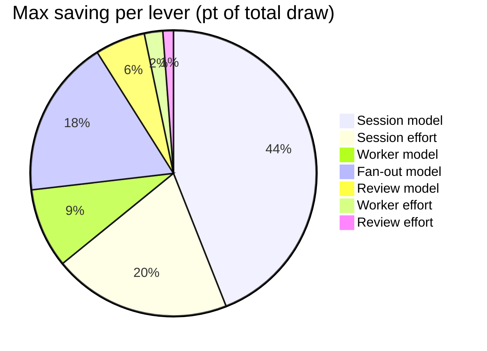

# Lever inventory

Last updated: 2026-07-16

| # | Lever | Where | Options | Cost (pt of total draw) | Impact (0-100) |
|---|---|---|---|---|---|
| 1 | Session model | `/model`, `--model`, `ANTHROPIC_MODEL` (live) | fable opus sonnet haiku | fable -0 opus -11pt sonnet -35pt haiku -59pt | 100 |
| 2 | Session effort | settings.json, `--effort`, `CLAUDE_CODE_EFFORT_LEVEL` (live) | max xhigh high medium low | max -0 xhigh -12pt high -27pt medium -27pt low -27pt | 50 |
| 3 | Review model | `model:` frontmatter in `agents/code-review-agent.md`, `plan-review-agent.md`, `qa-planner-agent.md`, `security-expert-agent.md` | fable opus sonnet haiku | fable -0 opus -4.2pt sonnet -5.9pt haiku -7.6pt | 60 |
| 4 | Review effort | `effort:` frontmatter in the same review agent files | max xhigh high medium low | max -0 xhigh -0.7pt high -1.6pt medium -1.6pt low -1.6pt | 35 |
| 5 | Worker model | `agents/worker-agent.md` `model:` | fable opus sonnet haiku | fable -0 opus -6.7pt sonnet -9.4pt haiku -12.1pt | 25 |
| 6 | Worker effort | `agents/worker-agent.md` `effort:` | max xhigh high medium low | max -0 xhigh -1.3pt high -2.8pt medium -2.8pt low -2.8pt | 10 |
| 7 | Fan-out model | `dev-workflow/SKILL.md` `agent()` `model` opt | inherit (session) fable opus sonnet haiku | inherit - fable -0 opus -13pt sonnet -19pt haiku -24pt | 10 |

Impact rationale per lever: [lever-impact.md](lever-impact.md)

Excluded — do not re-add: fast mode, advisor model, context ceiling, deep-tier dispatch, per-card model, skill frontmatter overrides.
