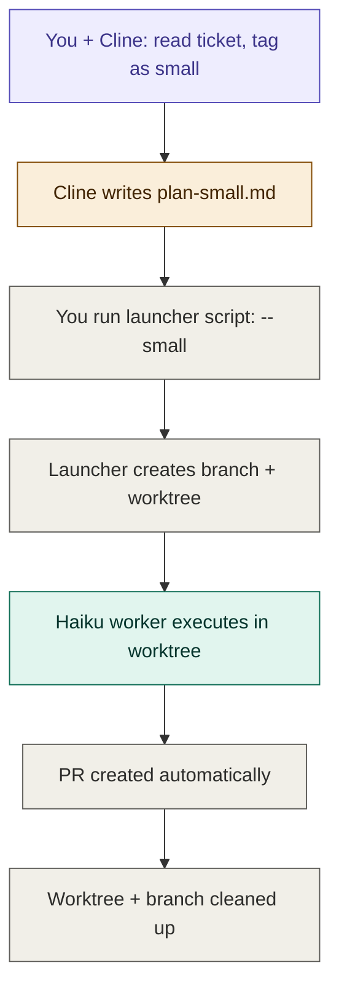
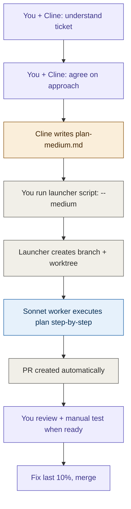
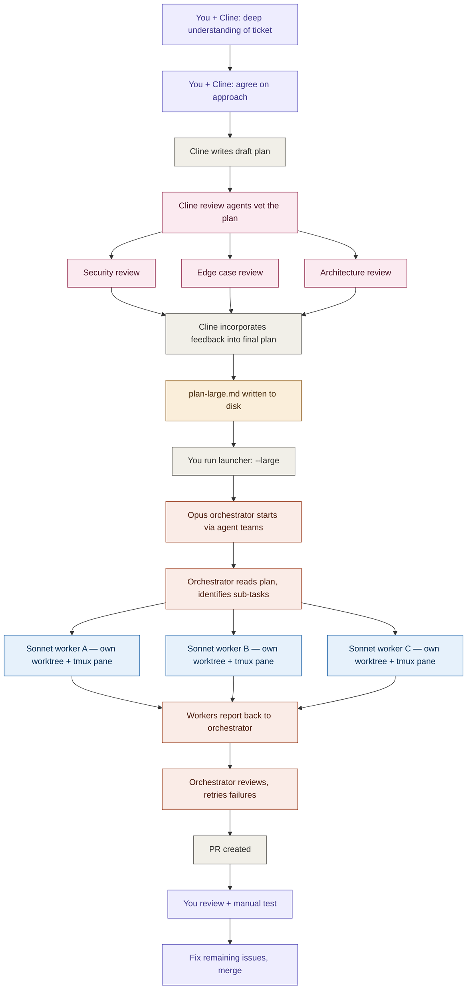
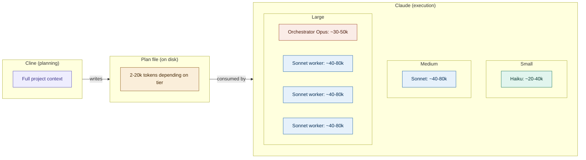

# Hybrid Execution Workflow Spec

## Overview

A two-tool workflow where **Cline handles planning** and **Claude Code handles execution**. Plans are written in Cline, then handed off to Claude Code instances that execute them in parallel via worktrees. The plan file is the interface between the two systems.

The goal: you stay in Cline planning the next ticket while Claude instances crank through already-planned work in the background. Planning never stops. Execution never waits.

---

## Architecture

There are three execution tiers based on ticket size. Each tier increases planning depth and execution complexity.

| Tier   | Planning depth                                            | Executor               | Model                              | Orchestrator? |
| ------ | --------------------------------------------------------- | ---------------------- | ---------------------------------- | ------------- |
| Small  | Minimal — ticket description is the plan                  | Single Claude instance | Haiku                              | No            |
| Medium | Steps, files, constraints, test expectations              | Single Claude instance | Sonnet                             | No            |
| Large  | Full plan with sub-tasks, reviewed by Cline review agents | Claude agent teams     | Opus orchestrator + Sonnet workers | Yes           |

---

## User Interaction Flow

### Triage

The user opens Cline and pulls their assigned tickets via the Jira skill. They review each ticket and tag it as small, medium, or large based on complexity. This is a judgment call — the skill should not auto-classify.

### Small Tickets



**How it feels to the user:**

1. You're in Cline. You say "work on STAX-42" (or whatever your command is).
2. Cline fetches the ticket via Jira skill, you glance at it, say "small, just do it."
3. Cline writes a `plan-small.md` to disk.
4. You run the launcher in a seperate terminal using an alias
5. You're done. Move to the next ticket. The Haiku instance handles it in the background.

**You are free after step 4.** No review needed for small tickets unless CI fails.

### Medium Tickets



**How it feels to the user:**

1. You're in Cline. You pull up the ticket.
2. You and Cline discuss it — what's the approach, what files are involved, any gotchas.
3. Instead of switching Cline to act mode, you tell Cline to write the plan.
4. Cline writes `plan-medium.md` to disk.
5. You launch it with the medium alias.
6. You move to the next ticket immediately. Sonnet handles execution and testing to reduce the need for human verification.
7. Later, when you have a break between planning sessions, you review the PR and do manual testing. The goal is for the plan to
   be good enough that the implementor fixes its own bugs. Then,
   when im reviewing I'm checking more for feel rather than correctness.

**You are free after step 5.** Review happens asynchronously whenever you're ready.

### Large Tickets



**How it feels to the user:**

1. You're in Cline. You pull up a complex ticket.
2. You and Cline go deep — understanding requirements, edge cases, architectural implications.
3. Cline writes a draft plan.
4. Cline automatically runs review agents against the draft (security, edge cases, architecture — whatever's relevant). These are Cline sub-agents with specific system prompts.
5. Cline and the user iterate until the plan is polished and ready.
6. You launch it via an alias in another terminal, fire and forget.
7. An Opus orchestrator session starts via Claude agent teams. It reads the plan, breaks it into sub-tasks, and spawns Sonnet workers — each in its own worktree and tmux pane.
8. You move to the next ticket. The orchestrator manages everything.
9. When workers finish, the orchestrator reviews output, retries any failures, and creates the PR.
10. You review and manually test when ready. Because the plan was reviewed before execution, the "last 10%" should be smaller than usual.

**You are free after step 6.** The orchestrator handles coordination, retries, and PR creation.

---

## Context Management

This is the core reason for the architecture. No single Claude instance should exceed ~100k tokens.



**Key rules:**

- Cline's project context never crosses into Claude. The plan file is the only bridge.
- The plan file carries just enough for a worker to execute without needing full project understanding.
- For large tasks, the orchestrator holds plan summaries and worker status — not implementation details. Workers report back summaries, not full output.
- Each worker gets its own context window via agent teams. They never share context with each other.
- The orchestrator should stay under ~50k tokens. If it approaches 100k, something is wrong — the plan wasn't detailed enough or the task should have been broken into separate tickets.

---

## Plan File Formats

All plans are markdown files. The planning skill produces the correct format based on ticket size.

### plan-small.md

Minimal. Basically the ticket description with just enough structure for a headless worker.

```markdown
# STAX-42: Fix typo in error message

## Size: small

## Branch: fix/stax-42-typo

## What to change

- File: `src/api/errors.ts`
- Line ~23: change "authenication" to "authentication"

## Done when

- Typo is fixed
- Existing tests still pass
```

Target: ~2k tokens or less. The worker should be able to read this and start immediately.

### plan-medium.md

Structured enough that the worker doesn't need to make decisions. Steps, files, constraints, and test expectations are all specified.

```markdown
# STAX-78: Add rate limiting to /api/upload

## Size: medium

## Branch: feature/stax-78-rate-limit

## Context

The upload endpoint currently has no rate limiting. Users can spam uploads which causes S3 costs to spike.

## Files to touch

- `src/middleware/rateLimit.ts` (new file)
- `src/api/upload.ts` (apply middleware)
- `tests/api/upload.test.ts` (add rate limit tests)

## Steps

1. Create `src/middleware/rateLimit.ts` implementing a sliding window rate limiter.
2. Use the existing Redis client at `src/lib/redis.ts` for the sliding window counter.
3. Configure: 10 requests per minute per authenticated user, keyed by `userId`.
4. Return HTTP 429 with `Retry-After` header (seconds until window resets).
5. Apply the middleware to the upload route in `src/api/upload.ts`.
6. Add tests:
   - Request under limit succeeds
   - Request at limit returns 429 with correct Retry-After
   - Window resets after expiry
   - Unauthenticated requests are rejected (existing behavior, just verify not broken)

## Constraints

- Do NOT modify the existing auth middleware chain ordering in `src/api/upload.ts`.
- Do NOT add new dependencies — use the existing `ioredis` client.
- Rate limit key format: `ratelimit:upload:{userId}`.

## Done when

- All new tests pass
- Existing upload tests still pass
- `pnpm lint` passes
```

Target: ~5-10k tokens. Detailed enough that a Sonnet worker can execute without asking questions.

### plan-large.md

Full plan with architectural context, sub-task breakdown, edge cases, test matrix, and explicit boundaries. This is what the orchestrator reads to spawn workers.

```markdown
# STAX-112: Multi-tenant document permissions system

## Size: large

## Branch: feature/stax-112-doc-permissions

## Context

We need to add document-level permissions so that documents can be shared between tenants with granular access control (view, edit, admin). Currently documents are strictly scoped to the owning tenant.

### Architectural context

- Auth is handled by JWT middleware at `src/middleware/auth.ts`. The token payload includes `tenantId` and `userId`.
- Documents are stored in Postgres via Prisma. Schema at `prisma/schema.prisma`.
- API routes follow REST conventions in `src/api/`.
- Frontend consumes these via React Query hooks in `src/hooks/`.

## Sub-tasks

### Sub-task A: Database schema + migration

**Files:** `prisma/schema.prisma`, new migration file
**Steps:**

1. Add `DocumentPermission` model: `id`, `documentId`, `tenantId`, `userId` (nullable — tenant-wide vs user-specific), `level` (enum: VIEW, EDIT, ADMIN), `createdAt`, `grantedBy`.
2. Add unique constraint on `(documentId, tenantId, userId)`.
3. Add index on `(tenantId, documentId)` for permission lookups.
4. Generate and run migration.
   **Depends on:** Nothing — can run first or in parallel.

### Sub-task B: Permission service layer

**Files:** `src/services/documentPermissions.ts` (new), `src/services/documents.ts` (modify)
**Steps:**

1. Create `DocumentPermissionService` with methods: `grant()`, `revoke()`, `check()`, `list()`.
2. `check()` must resolve effective permission: user-specific > tenant-wide > owner (always ADMIN).
3. Modify `DocumentService.getById()` to call `check()` and throw 403 if no access.
4. Modify `DocumentService.update()` to require EDIT or ADMIN.
5. Modify `DocumentService.delete()` to require ADMIN.
   **Depends on:** Sub-task A (needs the schema).

### Sub-task C: API endpoints

**Files:** `src/api/documents.ts` (modify), `src/api/documentPermissions.ts` (new)
**Steps:**

1. Add `POST /api/documents/:id/permissions` — grant permission.
2. Add `DELETE /api/documents/:id/permissions/:permissionId` — revoke.
3. Add `GET /api/documents/:id/permissions` — list permissions for a document (ADMIN only).
4. Modify existing document endpoints to respect permissions via the service layer.
   **Depends on:** Sub-task B.

### Sub-task D: Tests

**Files:** `tests/services/documentPermissions.test.ts` (new), `tests/api/documentPermissions.test.ts` (new), `tests/api/documents.test.ts` (modify)
**Steps:**

1. Unit tests for `DocumentPermissionService`: grant, revoke, check resolution logic, edge cases.
2. Integration tests for new API endpoints: auth, validation, success paths.
3. Regression tests: verify existing document CRUD still works for document owners.
   **Depends on:** Sub-tasks B and C.

## Edge cases (from review)

- A user with tenant-wide VIEW and user-specific EDIT should resolve to EDIT.
- Revoking a tenant-wide permission should not affect user-specific permissions.
- Document owner always has ADMIN — this is implicit and cannot be revoked.
- Granting permission to your own tenant is a no-op (owner already has access).
- Deleted users' permissions should be cleaned up (but not in this ticket — note for future).

## Test matrix

| Scenario                                   | Expected              |
| ------------------------------------------ | --------------------- |
| Owner accesses own doc                     | ADMIN access          |
| Tenant user with VIEW permission reads doc | Success               |
| Tenant user with VIEW permission edits doc | 403                   |
| User with EDIT permission edits doc        | Success               |
| User with no permission reads doc          | 403                   |
| User-specific EDIT + tenant-wide VIEW      | Resolves to EDIT      |
| Revoke tenant perm, user perm remains      | User perm still works |
| Grant to own tenant                        | No-op, 200            |
| Non-ADMIN tries to grant                   | 403                   |

## Boundaries — do NOT touch

- `src/middleware/auth.ts` — no changes to auth middleware.
- `src/api/tenants.ts` — tenant management is out of scope.
- Frontend — this ticket is backend only.
- Do not add any new npm dependencies.

## Done when

- All new and existing tests pass
- `pnpm lint` passes
- Migration runs cleanly on a fresh database
- Sub-tasks A-D are all complete and integrated
```

Target: ~10-20k tokens. The orchestrator reads this and knows exactly how to split work across workers and in what order.

---

## Components to Build

### Claude side

#### 1. Orchestrator agent

**Location:** `~/.claude/agents/orchestrator.md`
**Model:** Opus
**Used for:** Large tickets only

Responsibilities:

- Reads a `plan-large.md` file
- Identifies sub-tasks and their dependencies
- Spawns Sonnet worker agents via agent teams, each in its own worktree
- Assigns one sub-task per worker
- Respects dependency ordering (e.g., don't start sub-task B until A is done)
- Monitors worker completion
- Reviews worker output at a summary level (did it complete? do tests pass?)
- Retries failed workers (escalate to Opus worker if Sonnet fails twice)
- Creates PR when all sub-tasks are complete
- Cleans up worktrees and branches

Hard rules:

- Never writes application code itself
- Never holds implementation details in its context — only plan summaries and worker status
- Never asks clarifying questions — the plan is finalized before it arrives
- If a plan is genuinely incomplete (missing sub-task details, contradictions), rejects it back to the user

#### 2. Implementer agent

**Location:** `~/.claude/agents/implementer.md`
**Model:** Varies (Haiku, Sonnet, or Opus depending on tier and retry escalation)
**Used for:** All tiers

Responsibilities:

- Receives a plan (or sub-task from a plan) as its system prompt / input
- Works exclusively in its assigned worktree
- Implements the plan step by step
- Writes and runs tests as specified in the plan
- Reports completion status
- Does NOT ask questions — if something is ambiguous, fails loudly with a clear error rather than guessing

Hard rules:

- Never works outside its worktree
- Never modifies files listed in the plan's "do not touch" boundaries
- Never installs dependencies unless the plan explicitly says to
- If tests fail after implementation, attempts to fix up to 3 times then reports failure

#### 3. Launcher script

**Location:** Somewhere on PATH (e.g., `~/bin/launch.sh`)
**Purpose:** Mechanical setup — the boring stuff that doesn't need an LLM

Usage:

```bash
./launch.sh --small plan-small.md    # Haiku worker, no orchestrator
./launch.sh --medium plan-medium.md  # Sonnet worker, no orchestrator
./launch.sh --large plan-large.md    # Opus orchestrator + Sonnet workers via agent teams
```

What it does:

1. Reads the plan file to extract the branch name.
2. `git checkout main && git pull`
3. Creates the branch.
4. Creates a sibling worktree: `git worktree add ../<repo>-wt-<branch> <branch>`
5. For small/medium: spawns a single Claude instance with the implementer agent, pointing at the worktree, with the plan as input. Runs in background.
6. For large: spawns a Claude instance with the orchestrator agent, with agent teams enabled, pointing at the worktree, with the plan as input.
7. Optionally sets terminal/tmux window title to the ticket ID for visibility.

### Cline side

#### 1. Planning skill

A Cline skill that handles the full planning flow. It uses the existing Jira skill for ticket data.

**Inputs:**

- Ticket ID (or the user just says "work on STAX-42")
- Size classification (user provides: small, medium, or large)

**Behavior by size:**

**Small:**

1. Fetch ticket details via Jira skill.
2. Write a `plan-small.md` using the small template.
3. Optionally run the launcher script automatically, or prompt the user to run it.

**Medium:**

1. Fetch ticket details via Jira skill.
2. Engage the user in understanding the ticket — ask questions, discuss approach.
3. Once the user agrees on the approach, write a `plan-medium.md` using the medium template.
4. Prompt the user to launch it (or launch automatically if configured).

**Large:**

1. Fetch ticket details via Jira skill.
2. Engage the user in deep understanding — architecture, implications, edge cases.
3. Write a draft plan.
4. Run review sub-agents against the draft:
   - Security review agent: looks for auth gaps, injection vectors, data exposure
   - Edge case review agent: identifies missing scenarios, boundary conditions
   - Architecture review agent: checks for consistency with existing patterns, identifies coupling risks
   - (These are Cline sub-agents with specific system prompts — they already exist or are straightforward to create)
5. Incorporate review feedback into the plan.
6. Write the final `plan-large.md` using the large template.
7. Prompt the user to launch it.

**Output location:** Plans are written to a known directory, e.g., `./plans/` in the repo root, or a configurable path. The launcher script reads from this path.

**Key behaviors:**

- The skill should NEVER switch to act mode or start implementing. Its only output is a plan file.
- For small tickets, the planning conversation should be near-zero — just confirm and write.
- For medium tickets, the conversation should be focused — understand, agree, write. No rabbit holes.
- For large tickets, the conversation can be as deep as needed. The review step is what distinguishes large from medium — it's the extra quality gate that reduces the "last 10%" of manual fixing.

---

## Plan File Location Convention

Plans are written to `./plans/` relative to the repo root. Naming convention:

```
plans/
  plan-STAX-42-small.md
  plan-STAX-78-medium.md
  plan-STAX-112-large.md
```

The launcher script finds the plan by the path you pass it. The `plans/` directory should be gitignored.

---

## What This System Does NOT Do

- **Ticket management.** Cline handles Jira status updates, assignments, etc. via the existing Jira skill. The Claude side never touches Jira.
- **Auto-classification.** The user decides if a ticket is small, medium, or large. The skill does not auto-classify.
- **Auto-merge.** PRs are created but never auto-merged. The user reviews and merges.
- **Frontend work.** This workflow is optimized for backend/fullstack tickets where implementation can be parallelized. Tickets that require visual iteration or browser testing need a different flow.
